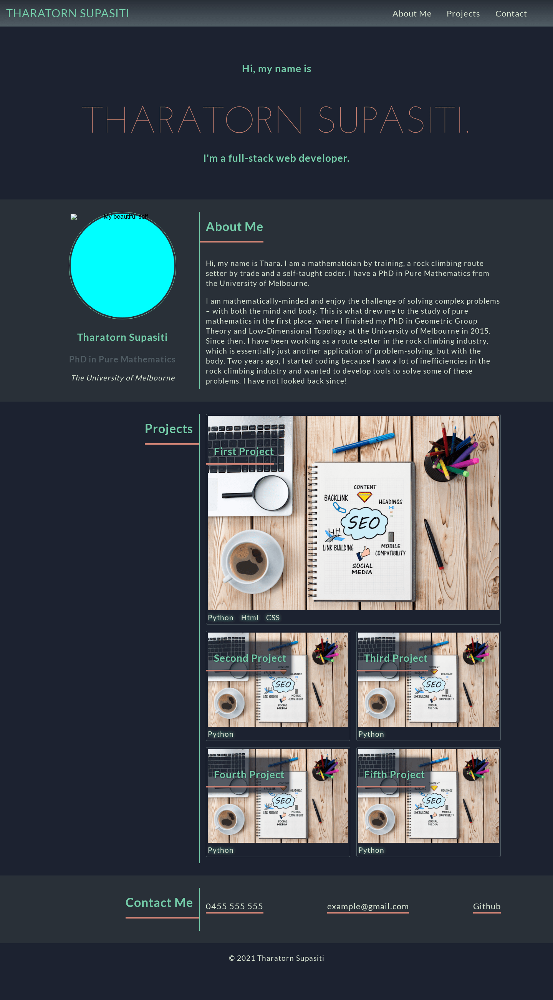

# 02-portfolio-web-demo

## Task

I was tasked to create a web application to showcase my portfolio of work. It needs to include
- the developer's name, recent photo and their biograpy;
- their work; and
- how to contact them.

Behaviorally, it needs to have easy accessible and functional navigational links that scroll
to all of these sections. It needs to be responsive to changing viewport sizes. 

In particular, I was provided with the following user story and acceptance criteria.

## User Story

```
AS AN employer
I WANT to view a potential employee's deployed portfolio of work samples
SO THAT I can review samples of their work and assess whether they're a good candidate for an open position
```

## Acceptance Criteria

Here are the critical requirements necessary to develop a portfolio that satisfies a typical hiring manager’s needs:

```
GIVEN I need to sample a potential employee's previous work
WHEN I load their portfolio
THEN I am presented with the developer's name, a recent photo or avatar, and links to sections about them, their work, and how to contact them
WHEN I click one of the links in the navigation
THEN the UI scrolls to the corresponding section
WHEN I click on the link to the section about their work
THEN the UI scrolls to a section with titled images of the developer's applications
WHEN I am presented with the developer's first application
THEN that application's image should be larger in size than the others
WHEN I click on the images of the applications
THEN I am taken to that deployed application
WHEN I resize the page or view the site on various screens and devices
THEN I am presented with a responsive layout that adapts to my viewport
```

### Preview

The end product should resemble the mock-up provided below:



> **Note:** This layout will change as the resolution drops below 992px and again at 768px.  


## Installation
[(Back to top)](#task)

To use this project, first clone the repo on your device using the commands below:

    git init
    git clone https://github.com/Supasiti/02-portfolio-web-demo.git


## Usage
[(Back to top)](#task)

The final webpage can be accessed through the following [link](https://supasiti.github.io/02-portfolio-web-demo/).


## Design Consideration
[(Back to top)](#task)

To meet all the acceptance criteria above, the following design decisions were considered.

### Responsive designs
- Two breakpoints at 992px and 768px were added into css media queries in order to transition between different screen sizes. 
- The font sizes were reduced between breakpoints to fit the screen better.
- Significant redesign of the main navigation bar was needed when the screen size reduces below 768px.
- A hamburger icon was added at the top left corner to allow a user to access the menu items.
- This menu can be closed by clicking on the 'x' icon at the bottom of the menu item list.
- To achieve ease of readibility, the overall layout of website was changed to a stack formation. This means the two-column layout in the portfolio section was reduced into one column.

### CSS limitation
When I tried to implement a hamberger icon interaction with menu items using only CSS and Html, I ended up with two choices:
- in the first choice, the icon is an invisible checkbox with hamburger as an icon, where the menu item list's visibility depends on the state of the checkbox;
- in the second, the icon is a `<a>` tag that is linked to a menu item list, which allowed me to use `:target` pseudo element selector.

Niether is a solution to an expect behaviour from a hamburger icon:
- in the first solution, when a menu item is clicked, a user expects that the menu list would disappear. However, since the visibility of the menu list is tied to the state of the checkbox, this cannot happen; 
- in the second solution, when the hamburger icon is clicked for the second time, one should expect the menu list to disappear. Since it is a `<a>` tag, it is simply direct you to the same the menu list again.

This exposed a type of problem that CSS is not designed to solve. A modified second solution was instead implemented; a button was added into the menu list that can close it. 

### Separation of concerns
For ease of maintenance, a `.html` file is largely concerned with holding the content of the webpage, whereas `.css` files are tasked with styling the page. 
- For consistent look of the webpage, I mostly followed 'Don't Repeat Yourself' principle.
- It has an advantage of having fewer places to change the values and thus reduce a risk of forgetting to change a parameter somewhere in the code. 
- However, a more generalised CSS code requires the `.html` file to know more about its styling and layout (ie. adding more generic classes like 'center', 'underline', etc..).  
- On the other hand, if each semantic element in the `.html` file get a unique CSS code, it will lead to multiple duplication in the `.css` file - far from ideal.
- Therefore, a balance was struck between keeping the concerns of the two files seperated and minimising code duplication.
